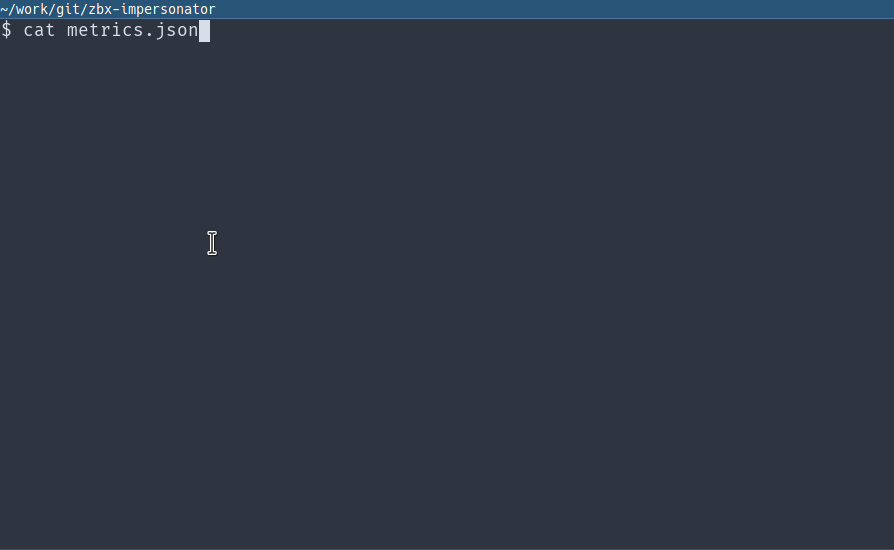

# Zabbix Impersonator

## Overview

This is a go server that implements the zabbix sender protocol [[1]](https://www.zabbix.com/documentation/3.4/manual/appendix/items/trapper) [[2]](https://www.zabbix.com/documentation/3.4/manual/appendix/protocols/header_datalen).

It listens on two ports:

* TCP port 10051 to listen to zabbix_sender requests.
* HTTP `/metrics` port 2112 to expose the Prometheus metrics.

The server is configured by a `metrics.json` file that contains the allowed zabbix metrics. All `zabbix_sender` requests received by the server that have a matching entry in `metrics.json` will be exposed via the `/metrics` interface on port 2112. All other metrics will be ignored.

## Demo

## `metrics.json`

The `metrics.json` file is an array of metrics that will be accepted by the server. Each metric supports the following arguments:

* `zabbix_key`: (mandatory) key name sent by the zabbix client. It corresponds to the `key name` defined in [this document](https://www.zabbix.com/documentation/3.4/manual/config/items/item/key). The `parameters` section (including the square brackets) must **not** appear in this field.
* `metric`: (optional) the name of the metric as exposed by the Prometheus client. If not defined, it will default to `zabbix_<sanitized_key_name>` (where the `sanitized_key_name` is the `key_name` after replacing all `.` occurrences with `_`).
* `help`: (optional) help string for the metric exposed by the Prometheus client.
* `args`: (optional) array of parameters as defined in [this document](https://www.zabbix.com/documentation/3.4/manual/config/items/item/key). If defined the zabbix client must send the metric with the `parameters` (including the square bracket) otherwise it will be skipped. This arguments will be defined as labels in the Prometheus metrics.

## Limitations

* The only metric kind currently supported is a GaugeVec.
* All values are parsed as float64.
* The Clock value for a trapper item is ignored.
* By design it only supports trapper items.

## Internal Prometheus metrics

* `processed_requests`: (counter) total number of processed zabbix_sender requests
* `invalid_requests`: (counter) total number of invalid zabbix_sender requests
* `processed_trapper_items`: (counter) total number of processed trapper items
* `skipped_trapper_items`: (counter) total number of skipped trapper items

## Future enhancements

* Add configuration file / cli parameters: zabbix host, port, zabbix server port, metrics json file path, etc.
* Add a cache for unknown metrics in order to expose them via internal prometheus metrics.
* Better logging.
